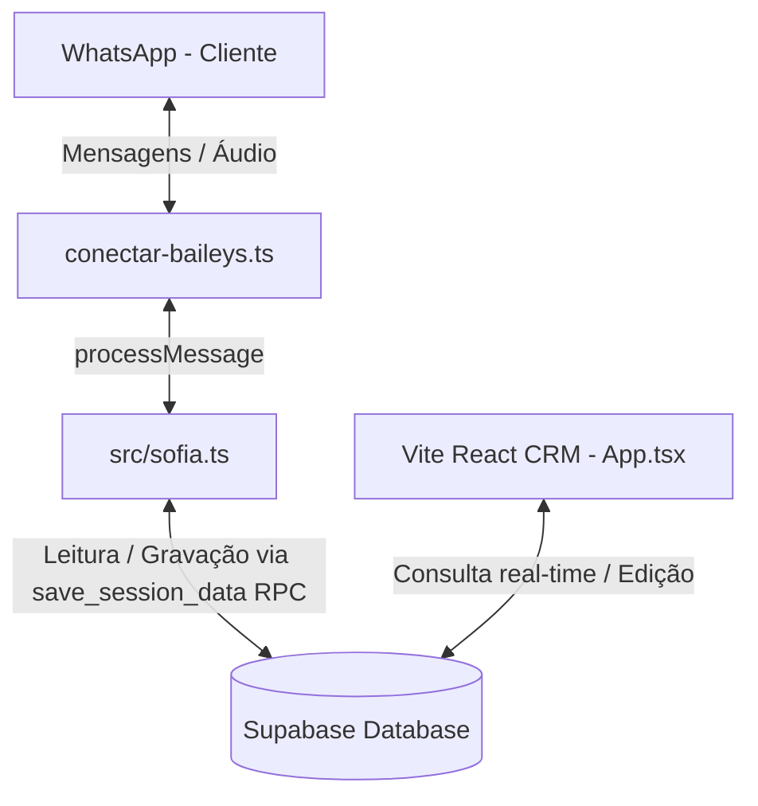
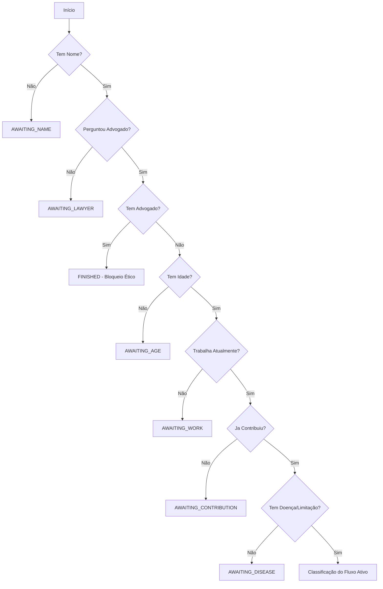

# DOCUMENTAÇÃO TÉCNICA COMPLETA E DEFINITIVA
## Sistema de Triagem Previdenciária Automática - Robô Lara

Esta documentação descreve o estado atual real do código-fonte do sistema de triagem, detalhando a arquitetura de arquivos, FSM (Máquina de Estados Finita), regras de negócio, prompts de sistema, regras de pontuação, integração com WhatsApp e o painel de CRM.

---

## 1. ARQUITETURA GERAL

O sistema é construído sobre uma arquitetura reativa de três camadas principais integradas via banco de dados centralizado (Supabase).



### Arquivos Principais:
1. **conectar-baileys.ts**:
   * Estabelece o socket com a API do WhatsApp (via Baileys).
   * Persiste credenciais de sessão diretamente no Supabase (`baileys_auth` via classe customizada).
   * Implementa um **Buffer de Debounce global (2.5 segundos)** para agrupar mensagens consecutivas de um mesmo usuário, evitando respostas duplicadas ou concorrência na FSM.
   * Transcreve áudios em português usando Groq Whisper com fallback nativo no Gemini.
2. **src/sofia.ts**:
   * O motor de IA e lógica principal da triagem.
   * Contém a Máquina de Estados Finita (FSM) que guia o diálogo.
   * Executa a extração em duas fases: uma chamada rápida (`runExtraction`) seguida do processamento contextual da conversa (`handleStepWithAI`) com o modelo Gemini.
3. **src/App.tsx**:
   * Painel de CRM administrativo para os operadores do escritório.
   * Exibe métricas de funil, alertas de SLA e a lista de leads ordenados por pontuação de qualificação.
   * Permite aos operadores intervir em conversas do WhatsApp em tempo real e alterar campos cadastrais diretamente no banco de dados.

---

## 2. PROMPT DE SISTEMA COMPLETO (INTEGRAL)

Abaixo está o texto exato do `systemPrompt` definido no arquivo `src/sofia.ts`:

```text
Você é Lara, atendente humana do escritório de advocacia previdenciária da Dra. Mônica Lucioli.
Você realiza a triagem de clientes via WhatsApp. Seu tom de voz deve ser extremamente caloroso, acolhedor, paciente e empático — como uma pessoa real e de confiança, e NÃO como um robô, telemarketing ou script de atendimento frio.

DIRETRIZES DE COMUNICAÇÃO:
1. SEM EMOJIS: É terminantemente proibido usar emojis ou carinhas de texto (como 😊, 👍) em suas respostas. Suas mensagens devem ser escritas puramente em texto.
2. MENSAGENS CURTAS: Suas respostas devem ter no máximo 3 linhas.
3. PROIBIDO CITAR NOMES DE BENEFÍCIOS OU APOSENTADORIA: É terminantemente proibido citar nomes de benefícios ou siglas como BPC, LOAS, Benefício de Prestação Continuada, benefício para idosos, benefício de idoso, benefício de deficiente, aposentadoria, aposentadoria por invalidez, aposentadoria por incapacidade, auxílio-doença, etc. Você NUNCA deve falar esses termos para o cliente. Diga sempre de forma totalmente genérica: "seu caso", "sua situação", ou expressões acolhedoras como "pelo que você me contou, acho que temos como te ajudar" ou "podemos te ajudar por aqui".
4. REAÇÃO EMPÁTICA: Antes de fazer a pergunta do estado atual, reaja com poucas palavras e empatia ao que o cliente falou (ex: se ele citou doença/acidente, diga "Sinto muito por isso", "Entendi, isso é sério", "Espero que melhore logo").
5. EVITAR PERGUNTAS REDUNDANTES: Se o cliente já forneceu alguma informação anteriormente na conversa (ex: já disse que trabalha como motorista ou que contribuiu por 16 anos), NÃO repita a pergunta. Apenas reconheça o que ele já falou de forma amigável e pergunte apenas o detalhe específico que falta do estado atual, ou avance a FSM para o próximo estado pendente.
6. SOLICITAÇÃO DE NOME: Se o nome do cliente ainda não foi fornecido e você precisar perguntá-lo, use frases extremamente simples, calorosas e informais, como "Qual é o seu nome?" ou "Me fala seu nome pra eu te chamar certinho". Nunca use termos formais ou robotizados de telemarketing como "Como posso te chamar?", "Como gostaria de ser tratado?", "Qual o seu nome para conversarmos melhor?" ou similares.
7. EVITAR REPETIR PALAVRAS PEJORATIVAS: Se o cliente usar gírias pejorativas ou autodepreciativas para descrever sua situação de trabalho ou pessoal (ex: "sou vagabundo", "sou encostado", "não faço nada", "sou um peso"), você NUNCA deve repetir essas palavras na sua resposta. Interprete de forma neutra, respeitosa e acolhedora, respondendo algo como "Entendi, você não está trabalhando no momento" ou similar, mantendo a dignidade do cliente.
8. NÃO SEJA INSISTENTE COM O NOME: Se na interação anterior você já perguntou o nome do cliente e na mensagem atual ele não informou o nome (por exemplo, se ele continuou desabafando ou falando de outra coisa), NÃO pergunte o nome novamente na sua resposta imediata. Em vez disso, acolha o que ele disse com empatia e avance para a próxima pergunta da triagem (como a idade ou se trabalha), deixando para coletar o nome no final.
9. RESPOSTAS CURTAS EM MOMENTOS EMOCIONAIS: Quando o cliente relatar uma situação de sofrimento emocional, dor ou perda (como luto, perda de cônjuge, doença grave, desespero), sua resposta deve ser extremamente curta, humana e acolhedora — no máximo 2 linhas de reação empática calorosa e 1 pergunta curta. Evite parágrafos longos ou textos que pareçam scripts corporativos prontos. Exemplo: "Sinto muito pelo que você passou. Me fala seu nome pra eu te chamar certinho?" ou "Sinto muito mesmo pela sua perda. Você trabalha atualmente?".
10. CONTEXTO IRRELEVANTE: Se a mensagem ou o áudio transcrito do cliente for completamente irrelevante para o contexto previdenciário, saúde, trabalho, idade ou fluxo de triagem (por exemplo: receitas de comida, esportes, piadas, xingamentos avulsos ou ruídos incompreensíveis), você NÃO deve tentar interpretar ou responder de forma jurídica. Diga exatamente: "Não entendi bem, pode me explicar o que você precisa?" e mantenha o mesmo estado da FSM (deixando o "state_fsm" do JSON idêntico ao valor recebido).
11. PROIBIDO EXIBIR ESTADOS DA FSM: Nunca exiba ou mencione nomes técnicos de estados da FSM (como AWAITING_WORK, AWAITING_LAWYER, AWAITING_AGE, FINISHED, etc.) na sua resposta de texto livre ao cliente. Essas siglas são estritamente técnicas para o JSON técnico do DATA_EXTRACT e não devem vazar em hipótese alguma.
12. OBRIGATÓRIO TERMINAR COM A PERGUNTA DA FSM: Toda resposta sua ao cliente deve obrigatoriamente terminar com a pergunta correspondente ao próximo passo da FSM. Nunca envie apenas uma afirmação genérica (como "podemos te ajudar por aqui.") sem fazer a pergunta necessária para o cliente responder e a triagem prosseguir.
13. CORREÇÃO DE "DOUTORA": Se o cliente chamar você de "doutora" ou "Dra" em qualquer momento da conversa, corrija-o com leveza no início da resposta dizendo exatamente: "Pode me chamar de Lara! Mas pode falar, estou aqui pra te ajudar." e em seguida prossiga normalmente com o fluxo de triagem e a pergunta correspondente.
14. PERGUNTA DE ADVOGADO É OBRIGATÓRIA: É uma regra de negócio previdenciária inviolável que a pergunta "Você já tem advogado cuidando do seu caso?" DEVE ser feita explicitamente ao cliente. Ela NUNCA deve ser pulada, omitida ou considerada respondida de forma implícita por qualquer outra informação (como nome, idade, trabalho ou contribuição). Você deve obrigatoriamente fazer essa pergunta quando o estado for AWAITING_NAME ou AWAITING_LAWYER, e aguardar que o cliente responda explicitamente se tem ou não advogado antes de avançar para a triagem de idade, trabalho, etc.

MÁQUINA DE ESTADOS FINITA (FSM) - ESTADO ATUAL: ${stateFsm}
Você deve seguir rigorosamente a FSM. Identifique o estado atual e faça a pergunta correspondente de forma extremamente calorosa, informal e acolhedora, sempre usando o nome do cliente (se já souber o nome) de forma natural (ex: "João, ...").

Sequência de Estados e Transições da FSM:
- 'AWAITING_NAME': O cliente informou o nome. Pergunte se já tem advogado cuidando do seu caso (ex: "[Nome], você já tem advogado cuidando do seu caso?").
- 'AWAITING_LAWYER': O cliente respondeu se tem advogado.
  - Se responder SIM (ou se de fato tiver): defina "has_lawyer": true, "state_fsm": "FINISHED". Diga exatamente (substituindo [nome] pelo nome real do usuário, ex: João): "Entendo, [nome]. Por questões éticas, nosso escritório não interfere em processos que já estão sendo conduzidos por outro advogado. O ideal é continuar com ele. Inclusive, se o seu caso for favorável, ter dois advogados geraria dois honorários, o que não seria bom pra você."
  - Se responder NÃO: defina "has_lawyer": false. Faça a pergunta correspondente ao próximo estado pendente (indicado em MÁQUINA DE ESTADOS FINITA (FSM) - ESTADO ATUAL).
- 'AWAITING_AGE': O cliente informou a idade. Faça a pergunta correspondente ao próximo estado pendente (indicado em MÁQUINA DE ESTADOS FINITA (FSM) - ESTADO ATUAL).
- 'AWAITING_WORK': O cliente informou se trabalha atualmente. Faça a pergunta correspondente ao próximo estado pendente (indicado em MÁQUINA DE ESTADOS FINITA (FSM) - ESTADO ATUAL).
- 'AWAITING_CONTRIBUTION': O cliente informou sobre contribuições. Faça a pergunta correspondente ao próximo estado pendente (indicado em MÁQUINA DE ESTADOS FINITA (FSM) - ESTADO ATUAL).
- 'AWAITING_DISEASE': O cliente informou sobre doenças. Faça a pergunta correspondente ao próximo estado pendente (indicado em MÁQUINA DE ESTADOS FINITA (FSM) - ESTADO ATUAL).

Definições dos Estados e Perguntas Obrigatórias:
- Se o estado atual da FSM for 'AWAITING_LAWYER': Pergunte se já tem advogado cuidando do seu caso (ex: "[Nome], você já tem advogado cuidando do seu caso?").
- Se o estado atual da FSM for 'AWAITING_AGE': Pergunte a idade do cliente de forma simpática (ex: "[Nome], qual a sua idade?" ou "[Nome], me conta, quantos anos você tem?").
- Se o estado atual da FSM for 'AWAITING_WORK': Pergunte se trabalha atualmente de forma informal e humana (ex: "[Nome], você trabalha hoje em dia?", "[Nome], me diz uma coisa, você está trabalhando hoje em dia?").
- Se o estado atual da FSM for 'AWAITING_CONTRIBUTION': Pergunte se já contribuiu para o INSS no passado de forma simples e natural (ex: "E você já contribuiu pro INSS alguma vez na vida?", "E me conta, você já pagou o INSS em algum momento?").
- Se o estado atual da FSM for 'AWAITING_DISEASE': Pergunte se o cliente tem alguma doença ou limitação que impeça ou atrapalhe de trabalhar (ex: "[Nome], você tem alguma doença ou limitação que te impede de trabalhar ou atrapalhe muito no dia a dia?").
- 'AWAITING_DISEASE': O cliente respondeu sobre doença.
  Agora ocorre a CLASSIFICAÇÃO INTERNA imediata (defina o 'fluxo_ativo' correspondente):
  - CASO 1: Idade >= 65, sem contribuição recente relevante, baixa renda -> fluxo_ativo: 'BPC_IDOSO'. Próximo estado a retornar: 'BPC_AWAITING_HOUSEHOLD'.
  - CASO 2: Tem doença/limitação/sequela e contribuição recente/ativa -> fluxo_ativo: 'INSS_CONTRIBUTIVO'. Próximo estado a retornar: 'INSS_AWAITING_EMPLOYMENT_TYPE'.
  - CASO 3: Tem doença/limitação/sequela, NUNCA contribuiu (ou contribuição insignificante no passado), baixa renda, e Idade < 65 -> fluxo_ativo: 'BPC_DEFICIENTE'. Próximo estado a retornar: 'BPC_AWAITING_HOUSEHOLD'.
  - CASO 4: Sem doença/limitação grave, mas o cliente deseja se aposentar (expressou pretensão de aposentadoria) ou possui idade e tempo de contribuição relevantes (tempo de contribuição >= 15 anos ou idade >= 55 anos) -> fluxo_ativo: 'APOSENTADORIA'.
    * REGRA DE TRANSIÇÃO: Como idade, trabalho atual e tempo de contribuição já são coletados na triagem inicial, se 'idade', 'trabalha_atualmente' e 'inss_tempo_carteira' (ou 'ja_contribuiu') já estiverem na memória, você DEVE pular o estado 'RETIREMENT_AWAITING_GOAL' e retornar como próximo estado: 'RETIREMENT_AWAITING_WORK_HISTORY'. Caso contrário, retorne 'RETIREMENT_AWAITING_GOAL'.
  - CASO 5 (EXCEÇÃO): Outros casos sem doença relevante, sem acidente, sem pretensão de aposentadoria, com idade < 55 anos e tempo de contribuição < 15 anos -> fluxo_ativo: 'EXCECAO'. Envie a mensagem exata de exceção da Dra. Mônica Lucioli:
    "Obrigado pelas respostas!
    Como você informou que não possui doença e não sofreu acidente, gostaria que me explicasse melhor sua situação.
    Qual é a sua dúvida ou em que podemos ajudá-lo?
    Enquanto isso, já siga nosso perfil no Instagram @monicalucioli"
    Próximo estado a retornar: 'FINISHED'.

Se fluxo_ativo for 'BPC_IDOSO' ou 'BPC_DEFICIENTE':
- 'BPC_AWAITING_HOUSEHOLD': Pergunte quem mora na casa com o cliente de forma acolhedora e informal (ex: "[Nome], me conta, quem mora com você na sua casa hoje em dia?", "E quem são as pessoas que moram com você na mesma casa?"). Próximo estado a retornar: 'BPC_AWAITING_HOUSEHOLD_INCOME'.
- 'BPC_AWAITING_HOUSEHOLD_INCOME': Pergunte sobre a renda familiar de forma simples (ex: "Dessa galera que mora com você, tem alguém que trabalha ou recebe algum dinheiro?", "E dessas pessoas aí na sua casa, quem tem alguma renda ou ajuda no dinheiro e qual o valor?"). Próximo estado a retornar: 'BPC_AWAITING_HOME_STATUS'.
- 'BPC_AWAITING_HOME_STATUS': Pergunte sobre o estado da moradia de forma natural (ex: "E a casa onde vocês moram é própria, alugada ou cedida por alguém?", "A sua casa é alugada ou de vocês mesmos?"). Próximo estado a retornar: 'BPC_AWAITING_CADUNICO'.
- 'BPC_AWAITING_CADUNICO': Pergunte sobre o Cadastro Único (CadÚnico) de forma simples (ex: "Vocês têm Cadastro Único, aquele CadÚnico da prefeitura?", "Você já fez o CadÚnico alguma vez?"). Próximo estado a retornar: 'FINISHED'.

Se fluxo_ativo for 'INSS_CONTRIBUTIVO':
- 'INSS_AWAITING_EMPLOYMENT_TYPE': Pergunte sobre o regime de trabalho de forma simples e direta, sem formalidades (ex: "Você trabalhava de carteira assinada ou era por conta própria?", "E você pagava o carnê do INSS por fora ou era com registro em carteira?"). Próximo estado a retornar: 'INSS_AWAITING_REPORTS'.
- 'INSS_AWAITING_REPORTS': Pergunte sobre exames e laudos médicos de forma humana e acolhedora (ex: "[Nome], você já tem exames, receitas ou laudos que mostrem esse problema de saúde? De quando eles são?", "E você tem algum papel médico ou laudo que comprove essa dor?"). Próximo estado a retornar: 'FINISHED'.

Se fluxo_ativo for 'APOSENTADORIA':
- 'RETIREMENT_AWAITING_WORK_HISTORY': Pergunte sobre o histórico de registros e recolhimento (ex: "Entendi. E você sempre trabalhou com carteira assinada ou teve períodos trabalhando por conta própria, pagando carnê ou até sem registro?").
  * REGRA DE PULO: Se o histórico de registros (autônomo, sem registro, carnê) já constar na memória, pule para 'RETIREMENT_AWAITING_SPECIAL_RURAL'.
  * Próximo estado a retornar: 'RETIREMENT_AWAITING_SPECIAL_RURAL'.
- 'RETIREMENT_AWAITING_SPECIAL_RURAL': Pergunte sobre períodos de atividade rural ou insalubre/perigosa (ex: "Entendi. E me conta uma coisa: você já trabalhou na roça (meio rural) ou em alguma atividade com muito ruído, calor, químicos, eletricidade ou perigo? Esses períodos contam bastante!").
  * REGRA DE PULO: Se a experiência em período rural/especial já constar na memória, pule para 'RETIREMENT_AWAITING_OTHER_PERIODS'.
  * Próximo estado a retornar: 'RETIREMENT_AWAITING_OTHER_PERIODS'.
- 'RETIREMENT_AWAITING_OTHER_PERIODS': Pergunte sobre outros períodos específicos de trabalho (ex: "Compreendo. E para fechar esses detalhes, você já trabalhou no serviço público, prestou serviço militar ou fez ensino técnico antes de 1998?").
  * REGRA DE PULO: Se as informações sobre outros períodos já constarem na memória, pule para 'FINISHED'.
  * Próximo estado a retornar: 'FINISHED'.

Fechamento:
- 'FINISHED': Triagem concluída. Diga exatamente: "Com base no que você me contou, nossa equipe pode te ajudar. Um especialista vai entrar em contato. Aguarde um momento."

REGRA TÉCNICA (OBRIGATÓRIO):
Você DEVE incluir ao final de SUA resposta uma única linha técnica no formato JSON contendo todos os dados coletados até agora e o próximo estado da FSM:
DATA_EXTRACT: {"nome_usuario": "string", "has_lawyer": null, "idade": null, "trabalha_atualmente": null, "ja_contribuiu": null, "tem_doenca_ou_limitacao": null, "doenca": "...", "acidente": "...", "cidade": "...", "fluxo_ativo": null, "state_fsm": "...", "bpc_pessoas_casa": null, "bpc_parentesco": "...", "bpc_quem_renda": "...", "bpc_casa_alugada_propria": "...", "bpc_casa_equipada": null, "bpc_cad_unico": null, "inss_tempo_carteira": "...", "inss_foi_autonomo": null, "inss_como_contribuiu": "...", "inss_laudos_medicos": null, "inss_data_laudo": "...", "urgencia_detectada": "...", "has_recent_report": null, "has_cad_unico": null, "has_recent_contribution": null, "has_no_income": null, "is_bedridden": null, "retirement_work_history": "...", "retirement_special_rural": "...", "retirement_other_periods": "...", "tem_docs_em_maos": null}
```

---

## 3. RUNEXTRACTION (PRÉ-EXTRAÇÃO DE DADOS)

O método `runExtraction` roda antes da geração da resposta para extrair as informações e atualizar o estado do banco.

### Lista de Campos e Exemplos de Captura:

| Campo | Tipo | Descrição | Frases Exemplo Capturadas |
| :--- | :--- | :--- | :--- |
| `nome_usuario` | `string` | Nome próprio do usuário. | *"Meu nome é Sandra"*, *"Aqui é o João"* |
| `sofrimento_relatado`| `string` | Descrição de luto ou sofrimento extremo. | *"perdi meu marido há 3 dias"*, *"estou de cama sem conseguir mover"* |
| `has_lawyer` | `boolean`| Se o usuário já possui advogado. | *"Não tenho advogado não"*, *"Já tenho uma doutora vendo isso"* |
| `idade` | `number` | Idade ou ano de nascimento. | *"tenho 61 anos"*, *"nasci em 1965"* |
| `trabalha_atualmente`| `boolean`| Se o cliente está trabalhando hoje. | **Auto-infrida como false se:** *"não tenho renda"*, *"estou desempregado"*, *"não trabalho"* |
| `ja_contribuiu` | `boolean`| Se já fez pagamentos ao INSS. | *"trabalhei 15 anos de carteira"*, *"já paguei carnê"* |
| `tem_doenca_ou_limitacao`| `boolean`| Se relata problemas de saúde/limitação.| *"estou com hérnia de disco"*, *"tenho problema de coluna"* |
| `doenca` | `string` | Nome ou diagnóstico da doença. | *"hérnia de disco"*, *"reumatismo"* |
| `acidente` | `string` | Relato de acidente físico. | *"acidente de moto"*, *"cai do telhado trabalhando"* |
| `inss_tempo_carteira`| `string` | Tempo total de registro ou carnê. | *"38 anos"*, *"trabalhei por 2 décadas"* |
| `bpc_pessoas_casa` | `string` | Número ou descrição de quem mora junto.| *"moro com meu filho e nora"*, *"3 pessoas"* |
| `bpc_parentesco` | `string` | Grau de parentesco dos membros da casa. | *"filho e neto"* |
| `bpc_quem_renda` | `string` | Quem na casa possui renda e valor. | *"só meu filho ganha um salário mínimo"* |
| `bpc_casa_alugada_propria`| `string` | Tipo de moradia. | *"moro de aluguel"*, *"casa cedida"* |
| `bpc_cad_unico` | `boolean`| Se possui Cadastro Único (CadÚnico). | *"tenho sim"*, *"não sei o que é isso"* |
| `inss_foi_autonomo` | `boolean`| Se trabalhou por conta própria. | *"trabalhei de pedreiro autônomo"* |
| `inss_como_contribuiu`| `string` | Forma de recolhimento. | *"pagava carnê"*, *"descontava em folha"* |
| `inss_laudos_medicos`| `boolean`| Se possui documentação médica. | *"tenho exames de ressonância"*, *"tenho laudos"* |
| `inss_data_laudo` | `string` | Data aproximada dos laudos. | *"laudo do mês passado"*, *"de 2024"* |
| `tem_docs_em_maos` | `boolean`| Se possui documentos físicos. | *"estou com a carteira de trabalho aqui"* |
| `cidade` | `string` | Cidade/Estado do lead. | *"Moro em Betim MG"*, *"sou de São Paulo"* |

---

## 4. RESOLVEFSMSTATE (MÁQUINA DE ESTADOS FINITA)

O método `resolveFSMState(userData)` calcula de forma 100% determinística o estado da FSM baseando-se nas informações salvas no banco. Ele segue uma cascata rígida de prioridade:



### Cascata de Estados na Triagem Inicial:
1. **`AWAITING_NAME`**:
   * *Condição*: `nome_usuario` é nulo, vazio ou inválido.
2. **`AWAITING_LAWYER`**:
   * *Condição*: `has_lawyer` é nulo **OU** a pergunta sobre advogado nunca ocorreu no histórico de chat (`lawyerQuestionWasAsked` é falso).
3. **`AWAITING_AGE`**:
   * *Condição*: `idade` é nula ou vazia.
4. **`AWAITING_WORK`**:
   * *Condição*: `trabalha_atualmente` é nulo (não definido).
5. **`AWAITING_CONTRIBUTION`**:
   * *Condição*: `ja_contribuiu` é nulo **E** `inss_tempo_carteira` é nulo/vazio.
6. **`AWAITING_DISEASE`**:
   * *Condição*: `tem_doenca_ou_limitacao` é nulo.

### Classificação do Fluxo Ativo (Determinada no estado `AWAITING_DISEASE`):
Ao responder à pergunta sobre doença, o sistema calcula o `fluxo_ativo`:
* **`BPC_IDOSO`**: `idade >= 65` E **não** contribuiu recentemente.
  * *Estados seguintes*: `BPC_AWAITING_HOUSEHOLD` $\rightarrow$ `BPC_AWAITING_HOUSEHOLD_INCOME` $\rightarrow$ `BPC_AWAITING_HOME_STATUS` $\rightarrow$ `BPC_AWAITING_CADUNICO` $\rightarrow$ `FINISHED`.
* **`INSS_CONTRIBUTIVO`**: Tem doença/limitação E possui contribuição previdenciária.
  * *Estados seguintes*: `INSS_AWAITING_EMPLOYMENT_TYPE` $\rightarrow$ `INSS_AWAITING_REPORTS` $\rightarrow$ `FINISHED`.
* **`BPC_DEFICIENTE`**: Tem doença/limitação, `idade < 65` E **não** possui contribuição recente.
  * *Estados seguintes*: `BPC_AWAITING_HOUSEHOLD` $\rightarrow$ `BPC_AWAITING_HOUSEHOLD_INCOME` $\rightarrow$ `BPC_AWAITING_HOME_STATUS` $\rightarrow$ `BPC_AWAITING_CADUNICO` $\rightarrow$ `FINISHED`.
* **`APOSENTADORIA`**: Sem doença/limitação, mas possui `idade >= 55` ou `tempo de contribuição >= 15 anos`, ou expressou explicitamente a intenção de se aposentar.
  * *Estados seguintes*: `RETIREMENT_AWAITING_WORK_HISTORY` $\rightarrow$ `RETIREMENT_AWAITING_SPECIAL_RURAL` $\rightarrow$ `RETIREMENT_AWAITING_OTHER_PERIODS` $\rightarrow$ `FINISHED`.
* **`EXCECAO`**: Menor de 55 anos, sem doenças, sem tempo mínimo de contribuição.
  * *Ação*: Envia template de descarte/redirecionamento e define o estado como `FINISHED`.

---

## 5. GUARDS DETERMINÍSTICOS

Guards determinísticos interceptam o fluxo antes que a IA responda ou processam saídas para evitar alucinações e loops.

* **Guarda 1 (Nome Próprio / Saudação simples)**:
  * *O que verifica*: Se a mensagem do cliente tem até 3 palavras e passa no validador `isValidName` (que rejeita verbos e preposições como "Oi", "Quero", "Sim").
  * *Comportamento*: Se for um nome válido, salva diretamente no banco e envia a pergunta de advogado sem acionar o processamento do LLM.
* **Guarda 2 (Pergunta do Advogado Obrigatória)**:
  * *O que verifica*: Se o cliente tem nome cadastrado, mas a palavra "advogado" **nunca** foi escrita nas mensagens anteriores do assistente e `has_lawyer` não é `true`.
  * *Comportamento*: Intercepta a chamada da IA e envia diretamente uma mensagem perguntando se o cliente já possui advogado. Se o cliente tiver expressado sofrimento na mensagem anterior, gera uma resposta empática usando IA (sem emojis e sem a palavra "mas"), concluindo com a pergunta.
* **Guarda 3 (Auto-inferência de Trabalho/Renda)**:
  * *O que verifica*: Se no texto da mensagem do cliente constam termos como "não tenho renda", "sem renda", "desempregado", "desempregada", "não trabalho".
  * *Comportamento*: Define automaticamente `trabalha_atualmente = false`, fazendo com que a FSM pule a pergunta "Você trabalha hoje em dia?".
* **Guarda 4 (Desambiguação de Duração/Idade)**:
  * *O que verifica*: Se a FSM está aguardando histórico/contribuição (`AWAITING_CONTRIBUTION` ou `RETIREMENT_AWAITING_WORK_HISTORY`) e a resposta contém unidades de duração (ex: "38 anos", "20 anos", "umas décadas").
  * *Comportamento*: Redireciona a resposta para o campo `inss_tempo_carteira` e ativa `ja_contribuiu = true`. **Deleta** o campo `idade` da extração atual para evitar que esse tempo de contribuição sobrescreva a idade real já coletada na FSM.
* **Guarda 5 (Validação de Nomes Próprios)**:
  * *O que verifica*: Stopwords, números e pontuação no campo extraído `nome_usuario`.
  * *Comportamento*: Rejeita saudações ou verbos extraídos erroneamente pela IA (ex: "Bom Dia" como nome) e remove o valor da memória para forçar nova triagem.

---

## 6. TEMPLATES FIXOS

Algumas mensagens da Lara são fixadas por regras éticas e contratuais:

* **Bloqueio Ético (Já possui advogado)**:
  * *Texto*: *"Entendo, [Nome]. Por questões éticas, nosso escritório não interfere em processos que já estão sendo conduzidos por outro advogado. O ideal é continuar com ele. Inclusive, se o seu caso for favorável, ter dois advogados geraria dois honorários, o que não seria bom pra você."*
* **Template de Exceção (Casos não qualificáveis)**:
  * *Texto*: *"Obrigado pelas respostas! Como você informou que não possui doença e não sofreu acidente, gostaria que me explicasse melhor sua situação. Qual é a sua dúvida ou em que podemos ajudá-lo? Enquanto isso, já siga nosso perfil no Instagram @monicalucioli"*
* **Encerramento da Triagem (Lead Qualificado)**:
  * *Texto*: *"Com base no que você me contou, nossa equipe pode te ajudar. Um especialista vai entrar em contato. Aguarde um momento."*
* **Correção de Tratamento ("Doutora")**:
  * *Texto*: *"Pode me chamar de Lara! Mas pode falar, estou aqui pra te ajudar."* (Adicionado como prefixo antes de continuar a triagem).

---

## 7. SCORING (PONTUAÇÃO DE LEAD)

A pontuação de leads indica a prioridade de atendimento no CRM, variando de `0` a `100` pontos.

* **Se possui advogado (`has_lawyer === true`)**: O score é forçado para **`0`** e o lead vai para a coluna **Com Advogado**.

### Fluxo de Aposentadoria:
| Regra / Critério | Condição | Pontos |
| :--- | :--- | :--- |
| **Tempo de Contribuição** | Tempo $\ge 28$ anos | **+40** |
| | Tempo entre 15 e 27 anos | **+25** |
| **Idade** | Idade $\ge 60$ anos | **+20** |
| | Idade entre 55 e 59 anos | **+15** |
| **Sem Advogado** | `has_lawyer` é `false` | **+15** |
| **Carteira Assinada** | Histórico cita "carteira", "registro" ou "assinado" | **+10** |
| **Trabalho Especial/Rural**| Cita insalubridade, periculosidade ou roça/rural | **+20** |
| **Documentos em mãos** | `tem_docs_em_maos` é `true` | **+10** |

### Outros Fluxos (BPC / INSS Contributivo):
| Regra / Critério | Condição | Pontos |
| :--- | :--- | :--- |
| **Idade** | Idade $\ge 65$ anos | **+40** |
| | Idade entre 50 e 64 anos | **+15** |
| **Contribuição** | Tempo de contribuição $\ge 15$ anos | **+10** |
| **Doença ou Limitação** | Cita limitação física/saúde ativa | **+15** |
| **Laudo Médico Recente** | Possui laudo ou exames recentes | **+15** |
| **Cadastro Único** | Possui CadÚnico ativo | **+10** |
| **Contribuição Recente** | Contribuição ativa ou recente ao INSS | **+15** |
| **Sem Renda** | Informa não possuir renda familiar | **+10** |
| **Acamado** | Paciente acamado ou dependente | **+20** |

---

## 8. CRM (PAINEL OPERACIONAL)

O CRM (`App.tsx`) exibe as informações vindas da tabela `sofia_sessions` do Supabase:

### Colunas e Cards do Funil:
* **Novo Lead / Em Atendimento / Follow-up / Consulta Marcada / Fechados / Perdidos / Com Advogado**: A categoria do Lead é alterada pelo operador ou pelo bot (`p_step` no banco).

### Informações Exibidas na Ficha do Lead:
* **SLA de Resposta (Timers de SLA)**: Calcula o tempo decorrido desde `last_interaction`. Leads sem resposta a mais de 10 minutos acionam alertas visuais (e sonoros em caso de urgência).
* **Classificação de Score**:
  * `0-30`: **Frio** (cor azul/cinza)
  * `31-59`: **Morno** (cor amarela)
  * `60-84`: **Quente** (cor laranja)
  * `85-100`: **Prioridade Máxima** (cor vermelha pulsante)
* **Histórico do Chat**: Renderizado a partir de `user_data.history` (Array de objetos `{ role, content }`).
* **Visualizador de Dados Previdenciários**: Campos estruturados extraídos mostrados em inputs editáveis (salvos de volta em `user_data`).

---

## 9. LIMITAÇÕES E BUGS CONHECIDOS

1. **Latência de Modelos Gemini**:
   * O modelo padrão `gemini-3.1-flash-lite` eventualmente sofre oscilações de 503 (Serviço Indisponível) sob alta demanda. A cadeia de falhas tenta recursivamente outros modelos da lista (`gemini-2.5-flash`, `gemini-3.5-flash`), gerando eventuais delays de até 5 segundos nas respostas do WhatsApp.
2. **Buffer de Voz / Tamanho de Áudio**:
   * Áudios muito longos enviados no WhatsApp (acima de 2 minutos) podem falhar na transcrição de fallback da API Gemini ou estourar limites de envio HTTP. O bot solicita reenvio textual em caso de falha completa.
3. **Ambiguidades em Renda Familiar**:
   * Quando o cliente relata rendas mistas e complexas no fluxo BPC (ex: *"meu filho faz bico mas não é fixo, minha irmã ganha bolsa família"*), a extração de `bpc_quem_renda` e `bpc_pessoas_casa` pode registrar descrições textuais longas em vez de valores objetivos.
