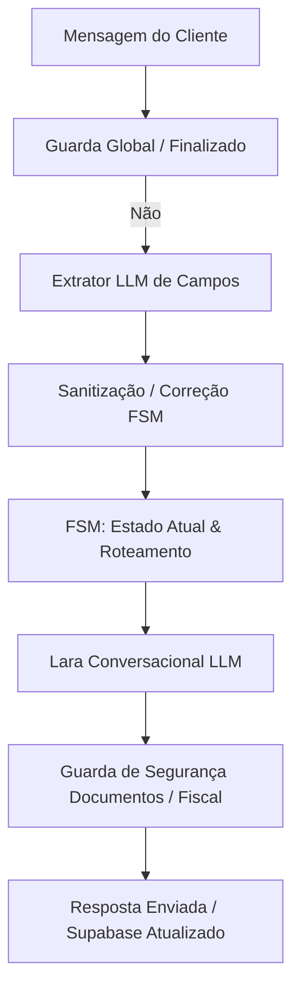

# Lara - Motor de Triagem Previdenciária Híbrido

Este documento descreve a arquitetura, regras de classificação, stack técnica e guia de operação do agente de triagem previdenciária (Lara).

## 1. Arquitetura do Agente (FSM + Guards)

O agente utiliza uma arquitetura híbrida que combina uma **Máquina de Estados Finitos (FSM) Determinística** com **Inteligência Artificial Generativa (LLM)**. Isso garante a consistência do fluxo de dados e, ao mesmo tempo, mantém a naturalidade da conversa.



### Componentes Principais:
- **Extrator de Dados (runExtraction):** O Gemini analisa a entrada do usuário e extrai dados cadastrais e de contexto estruturados em JSON (nome, idade, tempo de contribuição, doenças, etc.).
- **Sanitização de Dados (sanitizeExtractedData):** Ajusta dados extraídos de forma contextual baseado no estado atual da FSM, tratando ambiguidades (como "3 meses" que pode significar tempo de carteira ou tempo de afastamento dependendo do passo).
- **Máquina de Estados (resolveFSMState):** FSM que calcula deterministicamente a próxima pergunta necessária para qualificação.
- **Guarda Global (FINISHED / Advogado):** Filtros rígidos que interceptam e respondem instantaneamente sem chamar a API do Gemini caso o fluxo já esteja finalizado ou o cliente já possua advogado.
- **Lara Conversacional (handleStepWithAI):** LLM que gera a resposta natural em português a partir das diretrizes de tom de voz (sem emojis, muito curta, empática).

---

## 2. Funis de Triagem e Critérios de Classificação

O agente opera em duas fases principais:
- **Fase 1 (Triagem Inicial):** Coleta de dados gerais (Nome -> Advogado -> Idade -> Contribuição Total -> Contribuição Atual -> Tempo Afastado -> Doença -> Deficiência).
- **Fase 2 (Esteira de Decisão Inteligente):** Roteamento prioritário para o funil adequado após responder às perguntas iniciais.

### Critérios de Roteamento (Esteira de Entrada):
1. **Bypass de Aposentadoria Prioritário:** Se o cliente possui tempo de contribuição total $\ge 15$ anos ou idade $\ge 55$ anos com contribuição $\ge 5$ anos, é encaminhado **imediatamente** para `APOSENTADORIA`.
2. **INSS Contributivo (Auxílio-Doença):** Se relatar doença/limitação e estiver contribuindo atualmente ou ter parado há menos de 36 meses (qualidade de segurado).
3. **BPC/LOAS Idoso:** Se idade $\ge 65$ anos e não estiver contribuindo atualmente.
4. **BPC/LOAS Deficiente:** Se relatar doença/deficiência, não estiver contribuindo atualmente e o tempo sem pagar for maior que 24 meses.

---

## 3. Stack Técnica

- **Linguagem:** TypeScript
- **Runtime:** Node.js (executado via `tsx`)
- **Integração WhatsApp:** Baileys (conectar-baileys.ts) para gerenciamento de socket e envio/recebimento de mensagens e mídias.
- **Banco de Dados & Memória:** Supabase (Postgres) com chamadas a tabelas de sessões (`sofia_sessions`) e RPC para merges atômicos de dados (`save_session_data`).
- **Modelos de IA:**
  - Gemini-3.1-flash-lite / Gemini-2.5-flash como extrator de campos estruturados e chatbot conversacional.
  - Groq Whisper (Whisper-large-v3) com fallback nativo do Gemini (áudio base64) para transcrição de áudios.

---

## 4. Comandos de Operação

### Ligar o Robô (WhatsApp Bot)
Para iniciar a escuta do bot no WhatsApp (necessita escanear QR Code caso seja a primeira conexão):
```bash
npx tsx conectar-baileys.ts
```

### Limpar Banco de Dados (Resetar Sessões para Teste)
Para apagar as sessões ativas no banco de dados e iniciar novos testes do zero:
```bash
npx tsx limpar-sessoes.ts
```

---

## 5. Como Adicionar Novos Funis

Para expandir o agente com um novo funil previdenciário (ex: *Pensão por Morte*):

1. **Defina as Perguntas no STATE_QUESTIONS:**
   Adicione as chaves e perguntas específicas do novo funil no objeto `STATE_QUESTIONS` no topo do arquivo [sofia.ts](file:///c:/Users/gabri/Downloads/bpc-triagem-pro/src/sofia.ts).
   
2. **Atualize a Máquina de Estados (resolveFSMState):**
   - Na Esteira de Entrada (bloco `if (!fluxo_ativo)`), crie a regra de classificação que direciona o lead para o novo fluxo com base nas variáveis extraídas.
   - Adicione o bloco de transição específico para o novo funil, verificando quais dados específicos ainda estão vazios e retornando os estados correspondentes sequencialmente.

3. **Configure as Mapeações de Resposta (sanitizeExtractedData):**
   Adicione tratamentos de respostas curtas afirmativas ou negativas (`isPositive` / `isNegative`) para os estados específicos do seu novo fluxo se necessário.
